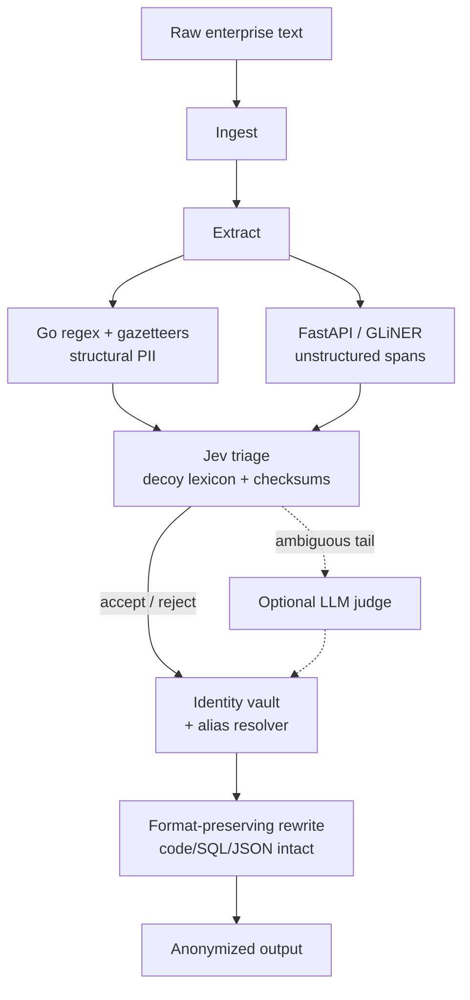

# Plexus

Plexus is a PII anonymization pipeline written in Go. It redacts personal data in unstructured enterprise text (chat logs, emails, tickets) by replacing every real identity with a **consistent synthetic "twin"** — the same person, email, phone number, and handle always map to the same fake identity across the whole corpus.

It is deliberately **deterministic-first**: structural PII and identity linkage are handled by plain Go (regex, checksums, a decoy lexicon, and an in-memory identity vault) and only the ambiguous tail is escalated to an optional LLM judge.

## Pipeline

```
Ingest -> Extract -> Triage -> Resolve -> Rewrite
```



- **Extract** — regex for structured PII (email, phone, Luhn-valid cards, national IDs, API keys, UUIDs, `@`/`<@>` mentions, employee IDs, account numbers, URLs), gazetteers (Census surnames, a company lexicon), and a GLiNER NER model served by a small FastAPI microservice (`scripts/ner_server.py`).
- **Triage** — a decoy lexicon and structural checks accept or reject most spans; only low-confidence ambiguous spans are escalated to the judge.
- **Resolve** — an alias resolver clusters `"Alex Rivera"`, `"Alex"`, `"A. Rivera"`, `"@alex_rivera"`, and `"alex.rivera@acmecorp.com"` into one identity, then mints a synthetic twin with an entropy guard so bare surnames and initials don't speculatively merge.
- **Rewrite** — format-preserving replacement that leaves code/SQL/JSON/shell blocks intact.

## Jev: the deterministic core

"Jev" is the deterministic Go layer that does the identity work the rest of the system relies on:

- **Decoy lexicon + checksums** — validates IDs (Luhn) and rejects tech terms *before* any model runs, so the common case never touches an LLM.
- **Arbiter** — three-tier routing: lexicon → structural → (optional) judge. Only low-confidence ambiguous spans are escalated.
- **Identity vault** — a bijective `source → twin` map: one real entity maps to exactly one synthetic identity, everywhere.
- **Alias resolver** — fuzzy clustering with an entropy guard, so `"Alex Rivera"` / `"A. Rivera"` / `"@alex_rivera"` / an email all collapse to one twin, but a bare surname or a single initial never speculatively merges.

## How it compares

Plexus loses the headline detection-F1 race: it sits at 72% on TonicAI, against Presidio's reported 89% and micro1 flow-transform's 96%. That gap is unstructured entity recall and is model-bound, not an engineering gap.

Where it is competitive despite that:

- **Speed and cost on the common case.** The deterministic core resolves structured PII and identity at microseconds per document; only the ambiguous tail would touch a model. End-to-end it runs ~25 docs/s on an RTX 4060 laptop (~64 ms/doc), with the Go layer effectively a rounding error. micro1's agentic flow puts an LLM review on every span — slower and more expensive by design.
- **Identity consistency.** Naive and Presidio-style tools mask spans independently and do not keep one real person as one synthetic identity across a corpus. Plexus holds `Linkage F1 = 1.0` deterministically through a bijective identity vault and an entropy guard.
- **Deterministic precision on structure.** Email, phone, username, and employee-ID detection run at 1.0 precision with no model, via regex and checksums.
- **Decoy resistance without an LLM.** Its internal suite reaches 0% decoy over-masking using lexicon + checksum triage, where micro1 needed agentic review to bring decoy over-masking down to ~40%.

What the structure actually delivers: a five-stage pipeline (ingest → extract → triage → resolve → rewrite) with deterministic identity linkage, format-preserving rewriting that protects code/SQL/JSON blocks (Fidelity 1.0, Coverage 1.0), gazetteer recall (Census surnames, a company lexicon), concurrency with multi-instance NER round-robin, an optional local/cloud LLM judge, a five-pillar TQI harness, and ~40 regression tests. It is a coherent baseline, not a claim to have beaten the state of the art.

## Benchmark results

**Internal suite** (`cmd/bench`, 8 synthetic cases):

```
Span F1:        1.0000
Decoy Error:    0.0000
Linkage F1:     1.0000
```

**TonicAI/Privacy-Bench** (`cmd/privbench`, 1,000 real docs, off-the-shelf `nvidia/gliner-pii` model, no judge):

```
Span F1:      0.7205   (Precision 0.822, Recall 0.641)
TQI:          80.68

EMAIL 1.00 | PHONE 1.00 | USERNAME 1.00 | EMPLOYEE_ID 1.00
NAME_FAMILY 0.83 | NAME_GIVEN 0.77 | ORGANIZATION 0.60
```

The structured identifiers and the deterministic identity layer (linkage, fidelity, coverage) are where it is strong; the open-entity recall (given names, locations, long-tail organizations) is the remaining gap and is model-bound, not an engineering gap.

> **TQI** (Transformation Quality Index) is a five-pillar score from micro1's methodology: Privacy (severity-weighted recall), Utility (severity-weighted precision), Coverage, Fidelity, and Coherence/Linkage, combined as `100 · P^0.40 · U^0.30 · C^0.05 · F^0.05 · L^0.20`. The figure here is computed on TonicAI with an off-the-shelf model, so it is not directly comparable to micro1's own published number.

## Speed

The Go layer costs microseconds per document; the Python NER model dominates the wall-clock time.

| | CPU | GPU (RTX 4060 Laptop) |
|---|---|---|
| 1,000-doc benchmark | ~8 min | **~40 s** |
| Throughput | 2.1 docs/s | **24.9 docs/s** |
| Latency/doc | ~475 ms | **~64 ms** |

## Running

```bash
# 1. Install Python deps
pip install -r scripts/requirements.txt

# 2. Start a NER worker (auto-moves to CUDA when a GPU is available)
python scripts/ner_server.py

# Optional: a second worker on :5001 for parallelism
PLEXUS_NER_PORT=5001 python scripts/ner_server.py

# 3. Run the Go side
go run ./cmd/bench                        # internal suite
go run ./cmd/privbench                    # TonicAI/Privacy-Bench (needs testdata/privacybench.jsonl)
go run ./cmd/plexus -input <file>         # anonymize a file
```

Configure endpoints and the optional judge in `.env`:

```bash
# one worker
PLEXUS_NER_ENDPOINT=http://127.0.0.1:5000/extract
# two workers (round-robin)
PLEXUS_NER_ENDPOINT=http://127.0.0.1:5000/extract,http://127.0.0.1:5001/extract

# optional local LLM judge (Ollama, OpenAI-compatible)
JUDGE_ENDPOINT=http://localhost:11434/v1/chat/completions
JUDGE_MODEL=qwen2.5:7b
```

The NER model is configurable via `PLEXUS_NER_MODEL` (`nvidia/gliner-pii` by default, or `urchade/gliner_small-v2.1`).

## Limitations

- Off-the-shelf models are the ceiling for unstructured entity recall; fine-tuning on enterprise/casual text is the clear next step.
- The judge is optional and off by default in benchmarks; on CPU it is too slow to run at volume.

## Disclaimer

This is a working prototype, not a hardened product. It is a reasonable baseline that demonstrates deterministic identity linkage, but it should not be treated as an audited anonymization guarantee.
